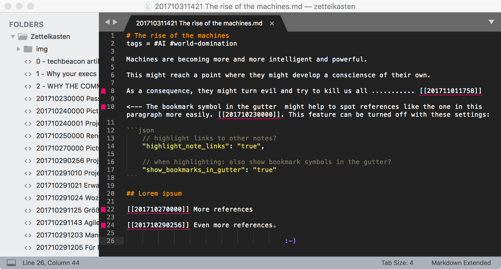

# Sublime ZK

This is a small extension for SublimeText3 to enable ID-based, Wiki-style links in your documents.

If you follow the (plain-text) Zettelkasten method (as proposed by [Zettelkasten.de](https://zettelkasten.de)), this might appeal to you.

In short, it helps you manage an archive of interlinked notes that look like this:



See the [Usage](#usage) section below to see how this package might support your workflow.

## Features

* This plugin enables you to place wiki style links like `[[this]]` into your notes to link to other notes in your note archive. 
* Clicking such a link and pressing `[ctrl]+[enter]` will open the corresponding note.
* Typing `[[` will open a list of existing notes so you can quickly link to existing notes.
* Typing `[shift]+[enter]` lets you enter a name for a new note. The new note is then created with a new note ID.
* Implicit note creation via links to non-existing notes' titles, see below.
* The ID format is YYYYMMDDHHMM - eg: 201710282111
* Highlighting of note links
* Highlighting of #tags
* Highlighting of footnote references `[^like this one]`


## Installation

The following steps cover all dependencies and prerequisites. Skip the steps you don't need:

1. Install [Sublime Text 3](http://www.sublimetext.com/3)
2. Download the sublime_zk zip from [this repo](https://github.com/renerocksai/sublime_zk).
3. Unzip the sublime_zk plugin. You should get a `sublime_zk` folder.
4. Under Preferences, go to 'browse packages'. This opens the package location of SublimeText in your file browser.
5. Copy the `sublime_zk` folder into the package location folder from the previous step.

You should be all set.


## Configuration


### Zettelkasten note folder

No further configuration is necessary. This Zettelkasten plugin works with SublimeText projects. It will use exactly the same directory where your SublimeText project file is located.

#### How do I create a project in SublimeText?

That's easier than it might look. This is how I do it:

* Start with a fresh SublimeText window (containing no open files or projects).
* Use the menu: "Projects" -> "Save Project As ..." and save this empty project into your desired Zettelkasten folder, giving the project file a name other than untitled if you like.
* Now add the Zettelkasten folder to your project: "Project" -> "Add Folder To Project..." and select your Zettelkasten folder.
* Done! :-)


### Markdown filename extension
By default, the extension `.md` is used for your notes. If that does not match your style, you can change it in the `sublime_zk.sublime-settings` file. Just replace `.md` with `.txt` or `.mdown` or whatever you like.

### IDs in titles of new notes
When you create a new note, its title will automatically be inserted and an ID will be assigned to it (see "Creating a new note"). If you want the ID to be part of the title, change the setting `id_in_title` from `false` to `true`.

Example for a note created with ID:

```markdown
# 201710310128 This is a note with its ID in the title
tags= 

The setting id_in_title is set to "true".
```

Example for a note created without ID:

```markdown
# A note without an ID
tags =

The setting id_in_title is set to "false"
```

You can find this setting in the file `sublime_zk.sublime-settings`.

### Highlight references to other notes

By default, this plugin highlights links to other notes by underlining them.

**Note:** This only applies to links containing an ID, like this one: [[201710290256]].

It also shows a bookmark symbol in the gutter to the left of your text. These features can be controlled via the following settings in `sublime_zk.sublime-settings`:


```json
    // highlight links to other notes?
    "highlight_note_links": "true",

    // when highlighting: also show bookmark symbols in the gutter?
    "show_bookmarks_in_gutter": "true"
```


## Usage

### Creating a new note

* Press `[shift]+[enter]`. This will prompt you for the title of the new note at the bottom of your SublimeText window. 
* Press `[ESC]` to cancel without creating a new note.
* Enter the note title and press `[enter]`.

A new note will be created and assigned the timestamp based ID in the format described above.

Example: Let's say you entered "AI is going to kill us all" as the note title, then a file with the name `201710282118 AI is going to kill us all.md` will be created and opened for you.

The new note will look like this:

```markdown
# AI is going to kill us all
tags = 

```

### Creating a link 

Let's assume, you work in the note "201710282120 The rise of the machines":

```markdown
# The rise of the machines
tags = #AI #world-domination

Machines are becoming more and more intelligent and powerful.

This might reach a point where they might develop a consciensce of their own.
```

You figure, a link to the "AI is going to kill us all" note is a good fit to expand on that aspect of the whole machine-rise story, so you want to place a link in there.

You start typing:

```markdown
# The rise of the machines
tags = #AI #world-domination

Machines are becoming more and more intelligent and powerful.

This might reach a point where they might develop a consciensce of their own.

As a consequence, they might turn evil and try to kill us all ........... [[
```

The moment you type `[[`, a list pops up with all the notes in your archive. You enter "kill" to narrow down the selection list and select the target note. Voila! You have just placed a link into your note, which now looks like this:

```markdown
# The rise of the machines
tags = #AI #world-domination

Machines are becoming more and more intelligent and powerful.

This might reach a point where they might develop a consciensce of their own.

As a consequence, they might turn evil and try to kill us all ........... [[201710282118]]
```

**Note:** Only files ending with the extension specified in `sublime_zk.sublime-settings` (`.md` by default) will be listed in the popup list. If your files end with `.txt`, you need to change this setting.

If you now click into `[[201710282118]]` and press `[ctrl]+[enter]`, the target note will be opened where you can read up on how AI is potentially going to kill us all.


### Implicitly creating a new note via a link

There is another way to create a new note: Just create a link containing its title and follow the link. 

To showcase this, let's modify our example from above: Say, the "AI is going to kill us all" does **not** exist and you're in your "The rise of the machines" note.

This is what it might look like:

```markdown
# The rise of the machines
tags = #AI #world-domination

Machines are becoming more and more intelligent and powerful.

This might reach a point where they might develop a consciensce of their own.
```

You now want to branch into the new thought you just had, that AI might potentially eventually be going to kill us all. You prepare for that by mentioning it and inserting a link, like this:

```markdown
# The rise of the machines
tags = #AI #world-domination

Machines are becoming more and more intelligent and powerful.

This might reach a point where they might develop a consciensce of their own.

As a consequence, they might turn evil and try to kill us all ........... [[AI is going to kill us all]]
```

**Note:** You will have to press `[ESC]` after typing `[[` to get out of the note selection that pops up, before entering the note title.

Now, in order to actually create the new note and its link, all you have to do is to click inside the new note's title and press `[control]+[enter]`, just as you would if you wanted to open a regular linked note.

And voila! A new note `201710282118 AI is going to kill us all.md` will be created and opened for you.

But the really cool thing is, that the link in the original note will be updated to the correct ID, so again you will end up with the following in the parent note:

```markdown
# The rise of the machines
tags = #AI #world-domination

Machines are becoming more and more intelligent and powerful.

This might reach a point where they might develop a consciensce of their own.

As a consequence, they might turn evil and try to kill us all ........... [[201710282118]]
```

**Note** how the note title "AI is going to kill us all" has been replaced by the note's ID "201710282118".

The new note will be pre-filled with the following text:

```markdown
# AI is going to kill us all
tags = 

```


## Credits

Credits, where credits are due: 

* I derived this work from Dan Sheffler's MyWiki code. [See his GitHub](https://github.com/dansheffler/MyWiki) and see the striking similarities ;-).
* Thanks to [Niklas Luhmann](https://en.wikipedia.org/wiki/Niklas_Luhmann) for coming up with this unique way of using a Zettelkasten.
* Thanks to the guys from [zettelkasten.de](https://zettelkasten.de) for their Zettelkasten related resources. There are not that many out there.

While we're at it, I highly recommend the following books (German); Google and Amazon are your friends:

* "Das Zettelkastenprinzip" / "How to take smart notes" will blow your mind.
* "Die Zettelkastenmethode" from Sascha over at zettelkasten.de will also blow your mind and expand on the plain-text approach of using a digital Zettelkasten. 


